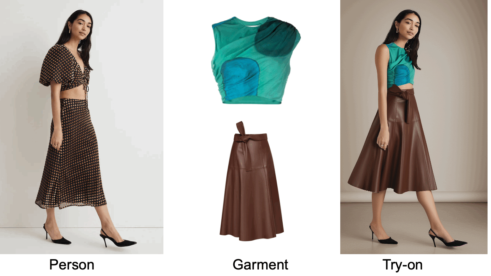

# OutfitAnyone

### 참고사이트

https://www.outfitanyone.org/

> [api 테스트 코드](test.ipynb)

### 사용된 라이브러리

1. gradio_client

   - 머신러닝 모델을 웹에서 쉽게 배포하고 사용할 수 있도록 도와주는 라이브러리.
   - 주로 웹에서 사용되며, 클라이언트 라이브러리는 사용자가 모델에 요청을 보내고 결과를 처리하는 데 도움을 줍니다

2. IPython.display

   - IPython은 대화형 컴퓨팅을 위한 도구를 제공하는 파이썬의 확장 버전
   - IPython.display 모듈은 주로 Jupyter Notebook과 같은 환경에서 사용되며, Rich output 표시를 제공하는 데 사용

     ex) 이미지, 오디오, 비디오
