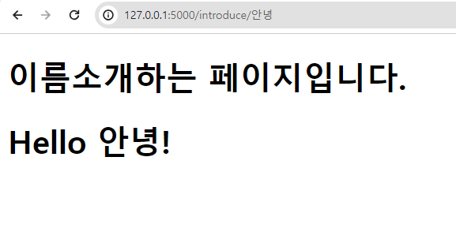

### Flask 설치
```
pip install Flask
```

### Flask 준비
```
from flask import Flask
```

### Flask 객체
```python
Flask( import_name , static_url_path=None , static_folder='static' , static_host=None , host_matching=False , subdomain_matching=False , template_folder='templates' , instance_path=None , instance_relative_config=False , root_path=None )
```

- Flask 애플리케이션 객체 생성

__name__ : 모듈명
```python
app = Flask(__name__)
```

- "Hello World!" 페이지 시작하기
```python
# app.py

@app.route('/')
def hello():
    return 'Hello World!'
```

위 코드를 시작하기전 기본 시작파일을 서버에 정의를 해야한다.

```
set FLASK_APP=app.py
```

   실행하기 

  > flask run -- host=0.0.0.0
  
  또는

```python
    # app.py

    if __name__ == '__main__':  
        app.run(host='0.0.0.0',port=5000,debug=True)
```

코드 실행후
> flask run

- 랜더링 템플릿
```python
#app.py
from flask import render_template # 랜더링 템플릿 준비

@app.route('/introduce/<name>')
def introduce(name='홍길동'):
    return render_template('test.html', name=name)
```
```html
<!-- test.html -->
<!DOCTYPE html>
<html lang="en">
  <head>
    <meta charset="UTF-8" />
    <meta name="viewport" content="width=device-width, initial-scale=1.0" />
    <title>Flask Test Page</title>
  </head>
  <body>
    <h1>이름소개하는 페이지입니다.</h1>
    
    <h1>Hello {{ name }}!</h1>
    
    <h1>아무도 없니? ㅠ</h1>
    
  </body>
</html>
```

<a>http://127.0.0.1:5000/introduce/안녕</a>




### 테스트 할 때 사용하는 함수, test_request_context()

> "테스트 환경에서 HTTP 요청을 모방하는 데 사용합니다."<br/>
Flask 애플리케이션 내에서 특정 URL에 대한 HTTP 요청을 테스트할 수 있습니다.
주로 웹 애플리케이션에서 사용자 입력을 화면에 표시할 때, 이스케이핑을 통해 보안 문제를 방지하는 데 활용됩니다.


```python
#  HTML, XML, JSON 등의 특수 문자를 이스케이핑(escape)하여 안전하게 표시할 수 있도록 도와주는 함수

from markupsafe import escape

...

@app.route('/user/<username>')
def show_user_profile(username):
    # 사용자가 입력한 username을 이스케이핑하여 템플릿에 전달
    return render_template('profile.html', username=escape(username))

with app.test_request_context():
    print(url_for('index'))
    print(url_for('login'))
    print(url_for('login', next='/'))
    print(url_for('profile', username='John Doe'))
```

위의 코드에서 주의할 점은 url_for() 에 들어가는 것은 위에서 정의한 함수들만 가능하다.

### request Mehod 설정
```python

from flask import request

@app.route('/login', methods=['GET', 'POST'])
def login():
    if request.method == 'POST':
        return do_the_login()
    else:
        return show_the_login_form()
```

### 정적파일

/staic 에 존재하는 파일 접근하기

```python
url_for('static', filename='style.css')
```
