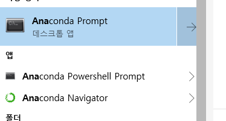
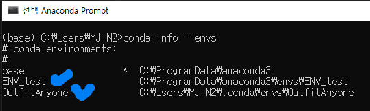
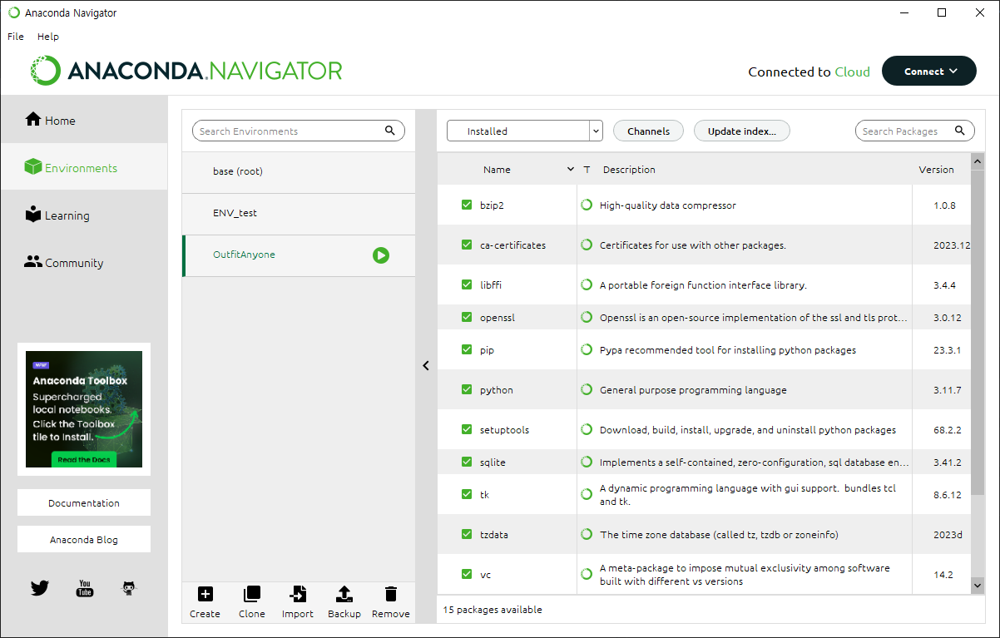

# 파이썬

## 참고 사이트
https://icedhotchoco.tistory.com/entry/Jupyter-Notebook-Anaconda-Virtual-Environment

## 개발환경 설정
1. 아나콘다와 쥬피터 노트북 설치

https://www.anaconda.com/products/distribution/

2. 아나콘다 프롬포트 열기



```
> conda update -n base conda
> conda update --all
```

3. 주피터 노트북 설치 및 실행, 접속
```
>pip install jupyter
```

```
>jupyter notebook
```
```
http://localhost:8888/tree
```


4. 생성한 가상환경 확인하기

anaconda Prompt 에서 아래와 같은 명령어를 통해 존재하는 가상환경 리스트를 확인할 수 있다.
```
conda info --envs  또는  conda-env list
```


5. 가상환경 설정(추가)

- 5-1. 네비게이터에서 추가하기
Enviroments > create 를 누르면 가성환경이 추가된다.
이때 오른쪽 상단에 installed보다 NotInstalled 후 필요한 라이브러리만 직접 다운받는게 프로젝트가 가벼울 것이다.



- 5-2. 프롬프트에서 생성하기
```
conda create -n 가상환경이름 python=버전
```


6. 가상환경 삭제

- 6-1. 네비게이터에서 삭제하기

아나콘다 네비게이터 창을 연다 > enviroments > 삭제할 가상환경선택 > delete

- 6-2. 프롬포트에서 삭제하기
```
conda remove --name 가상환경 이름 --all
```

7. 가상환경 활성화

```
conda activate 가상환경이름
```

8. 가상환경 비활성화
```
conda deactivate 가상환경이름
```

9. Jupyter Notebook에서 가상환경 연결하기

<b>프롬프트에서 연결하고자 하는 가상환경이 활성화 되어있는 상태에서 실행해야한다.</b>
```
jupyter notebook
```
```
python -m ipykernel install --user --name 가상환경이름 --display-name "커널출력이름"
```
[커널출력이름]은 주피터 노트북에서 보여지게될 이름을 뜻한다.<br>
따라서 [가상환경이름]과 [커널출력이름]이 동일하지 않아도 무방하다.

또한 프롬포트에서 바로 위의 코드를 실행하면 최상위 디렉토리로 실행된다. 원하는 프로젝트 폴더로 가고싶다면 아래의 코드를 입력하면된다.
```
cd Desktop/해당프로젝트폴더경로
```

10. 커널 연결 해제
```
jupyter kernelspec uninstall 가상환경이름
```